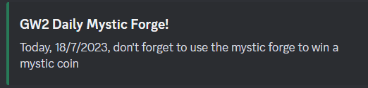

# Notification example

# What does the bot do?
- It sends a notification to IDCHANNEL the same day when the daily mystic forge can be done in GW2, after 6am (hour can be customized in the code).

# Install
- npm install
- Create a file called .env with:
    - TOKEN=YOUR_DISCORD_BOT_TOKEN
    - IDCHANNEL='YOUR_CHANNEL_ID'

# Run bot
- npm run start

The bot is tested with [discord.js v14](https://discordjs.guide/preparations/) (requires Node v16.9.0 or higher).